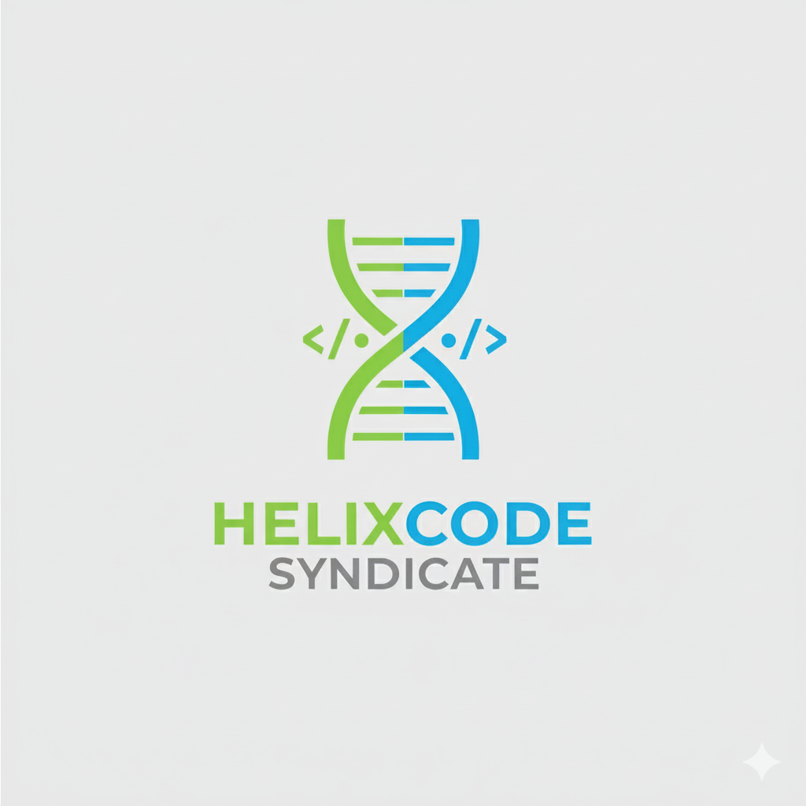

HelixCode Syndicate
===================

[The manifest](manifest.md)

FAQ
---

**What is the HelixCode Syndicate (HCS)?**

It is a community of software developers dedicated to merging computer science and biology, aiming to debug and re-engineer the genetic code like a master codebase by learning bioinformatics and approaching life with the mind of a programmer

**How do you plan to accomplish this?**

We plan to accomplish this by establishing two key initiatives: a study group and an action group.

The study group will focus on knowledge sharing. We will use a dedicated platform for resource sharing and hold regular virtual and in-person events to discuss concepts and findings.

The action group will be a collaborative, hands-on initiative. We will use GitHub, utilizing both our own organization's repositories and contributing to relevant projects across the biological community.

**I like the idea, how can I join?**

Follow the organization and join our [discord server](https://discord.gg/kY5DkCD6qp).
